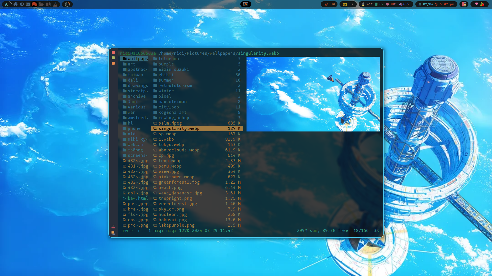
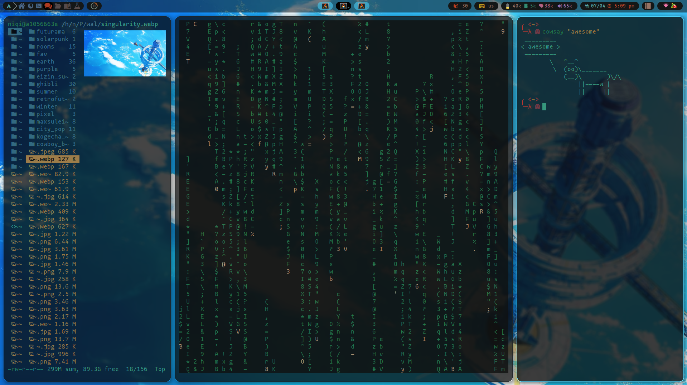

# My awesomeWM config. 
## Dependencies
- Git version of awesome
    ` paru -S awesome-git`
- 3rd party dependencies [bling](https://blingcorp.github.io/bling/#/), [relevation](https://github.com/guotsuan/awesome-revelation), [awesome-switcher](https://github.com/intpl/awesome-switcher)
# Demos

